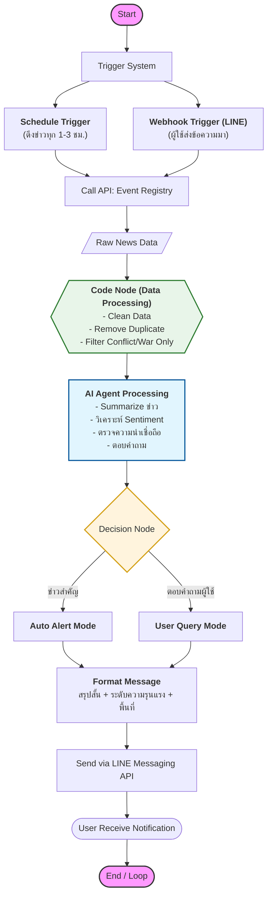

1. Project Title & Description
ชื่อโปรเจค: RT War Report (Real-Time War Report)
(Tagline): ระบบแจ้งเตือนและสรุปสถานการณ์ความขัดแย้งทั่วโลกแบบเรียลไทม์ด้วย AI ผ่าน LINE
ภาพรวม:โปรเจคนี้ทำหน้าที่ (ดึงข่าว -> สรุปด้วย AI -> แจ้งเตือน -> ตอบคำถาม)
2. Key Features (ฟีเจอร์หลัก)
Real-time Alerts: แจ้งเตือนเหตุการณ์สำคัญทันทีผ่าน LINE Messaging API
AI Summarization: สรุปเนื้อหาข่าวที่ซับซ้อนให้เข้าใจง่ายใน 3-5 บรรทัด
Sentiment & Credibility Filter: กรองข่าวปลอมและวิเคราะห์โทนของข่าว
Interactive Chatbot: ผู้ใช้สามารถสอบถามรายละเอียดเพิ่มเติมเกี่ยวกับเหตุการณ์เฉพาะเจาะจงได้
Multi-source Aggregation: ดึงข้อมูลจากแหล่งข่าวที่เชื่อถือได้ทั่วโลกผ่าน Event Registry
วิธีการติดตั้ง แอดไลน์ 

